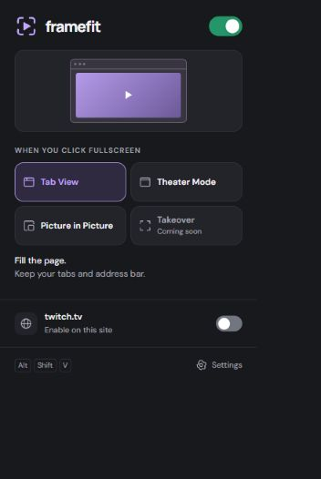
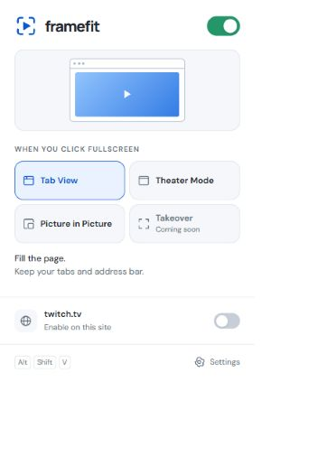

# FrameFit Extension

Current version: **2.5.0**

[Download FrameFit Extension.zip](./FrameFit%20Extension.zip?raw=true)

Make room to watch. FrameFit turns supported video fullscreen buttons into
**Tab View**, **Theater Mode**, or native **Picture in Picture**.

## Studio menu

The new menu has a visual mode preview, a larger green master switch, and settings
behind the gear. Choose **Studio Dark** or **Studio Light**. Fonts are bundled
locally. **Takeover** is marked Coming soon and cannot be selected yet.

## Install

1. Download **FrameFit Extension.zip** above and extract it into a permanent folder named **FrameFit Extension**.
2. Open `chrome://extensions` in Chrome and enable **Developer mode**.
3. Click **Load unpacked** and select the extracted folder containing `manifest.json`.
4. Refresh existing video tabs and pin FrameFit from Chrome's Extensions menu.
5. Open FrameFit on a video website and turn on **Enable on this site**.

Keep the extracted folder in place. Chrome loads the extension from that folder.
Requires Chrome 119 or later. Websites start off until you enable them.

## Use and update

Choose a viewing mode, then click a video's fullscreen button or use **Alt+Shift+V**.
Tab View fills the page while keeping browser controls. Theater Mode puts the
same video tab in a separate window with Chrome's title and URL bars. Picture in
Picture floats above other apps; some videos do not allow it.

In Theater Mode, **Return to tab** or **Esc** restores the page and returns the same
video tab. The window's native **X** closes the video tab. Close confirmation
defaults on, but Chrome controls when its generic Leave/Cancel warning appears.
Settings includes close confirmation and a switch to restore hidden Theater tips.

For updates, exit Theater Mode, replace the contents of your existing installation
folder with the new package, reload FrameFit at `chrome://extensions`, and refresh
video tabs. **After upgrading to 2.5.0, enable each video website in the menu.**
Global, viewing-mode, close-confirmation, and tip preferences are retained.
The old Chrome light palette becomes Studio Light; other old palettes become
Studio Dark.

## About this download

This repository distributes the installable extension only. Development tools,
tests, editable artwork, and development history are maintained separately.
The ZIP necessarily includes the JavaScript, HTML, CSS, fonts, and images Chrome
runs; those bundled files can be inspected.

Version 2.5.0 redesigns the menu and adds explicit site opt-in. It retains the
YouTube sizing and X playback repairs from 2.4.6. Takeover is not implemented.
The floating Minimize control remains removed.

34 background/settings tests and the package audit passed. The implemented popup
was checked in a browser fixture with simulated Chrome APIs, including both
themes, preference saving, site opt-in, unsupported pages, and loading/saving
errors. This is not installed-Chrome verification; the native popup and close
dialog still need a real Chrome smoke test. Earlier player checks were not rerun
for this menu update.

[Privacy policy](PRIVACY.md)
