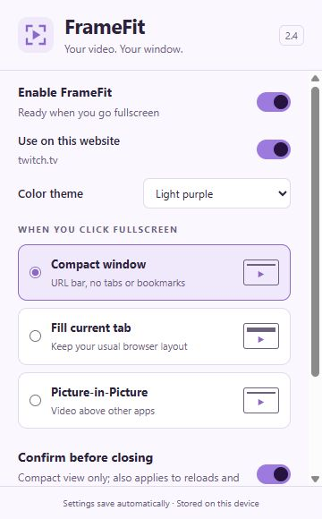

# FrameFit Extension

Current version: **2.4.4**

[Download FrameFit Extension.zip](./FrameFit%20Extension.zip?raw=true)

FrameFit lets you watch video in a compact browser window, fill the current tab, or use native Picture-in-Picture. Includes global and per-site switches and four menu themes.

## Menu preview

## Install

1. Download **FrameFit Extension.zip** above and extract it into a permanent folder named **FrameFit Extension**.
2. Open `chrome://extensions` in Chrome and enable **Developer mode**.
3. Click **Load unpacked** and select the extracted folder containing `manifest.json`.
4. Refresh existing video tabs and pin FrameFit from Chrome's Extensions menu.

Keep the extracted folder in place. Chrome loads the extension from that folder. Requires Chrome 119 or later.

## Use and update

Click a video's fullscreen button, or use **Alt+Shift+V**. Select your preferred viewing mode in FrameFit's menu.

In compact view, **Return to tab** or **Esc** restores the page and returns the same video tab. The window's native **X** closes the video tab. Close confirmation defaults on, but Chrome controls when its generic Leave/Cancel warning appears.

For updates, exit compact view, replace the contents of your existing installation folder with the new package, reload FrameFit at `chrome://extensions`, and refresh video tabs. Keeping the same installation folder helps retain preferences.

## About this download

This repository distributes the installable extension only. Development tools, tests, editable artwork, and development history are maintained separately. The ZIP necessarily includes the JavaScript, HTML, CSS, and images Chrome runs; those bundled files can be inspected.

Version 2.4.4 adds explicit YouTube video and control sizing on entry and after Escape or fullscreen-button exit, including delayed page layout changes. It retains the previous improvements: FrameFit opens compact view in a smaller normal window, handles responsive YouTube player moves, keeps its bottom controls inside the player, and makes its fullscreen button toggle back out. X/Twitter uses its video-and-controls component for expansion and supports the English-labeled fullscreen toggle. The floating Minimize control remains removed.

Validated with simulated Chrome APIs and browser fixtures. Live YouTube/X playback and the originally reported small-window failure still need an installed-Chrome smoke test.

[Privacy policy](PRIVACY.md)
